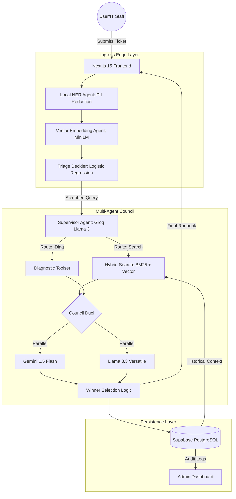
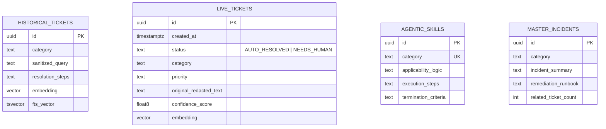
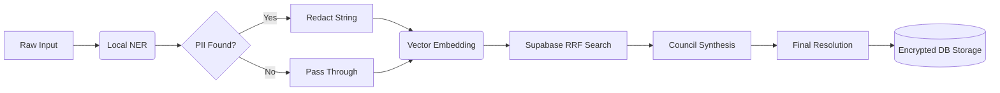
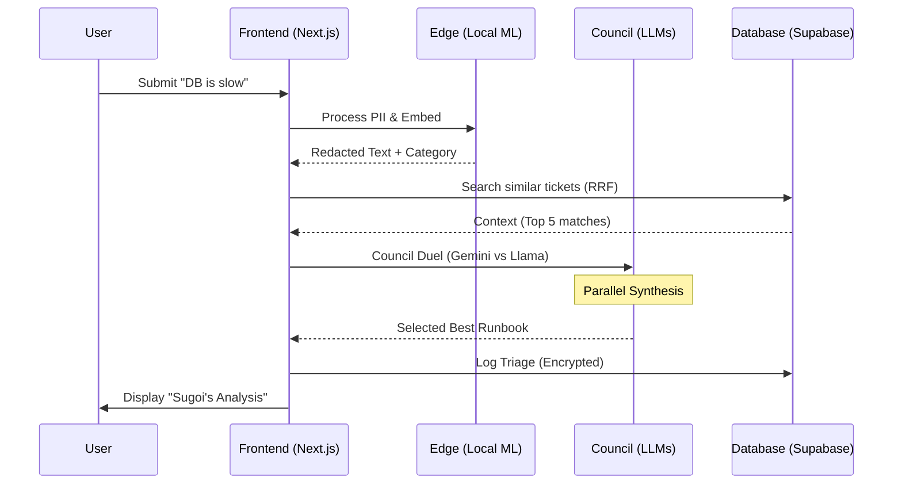
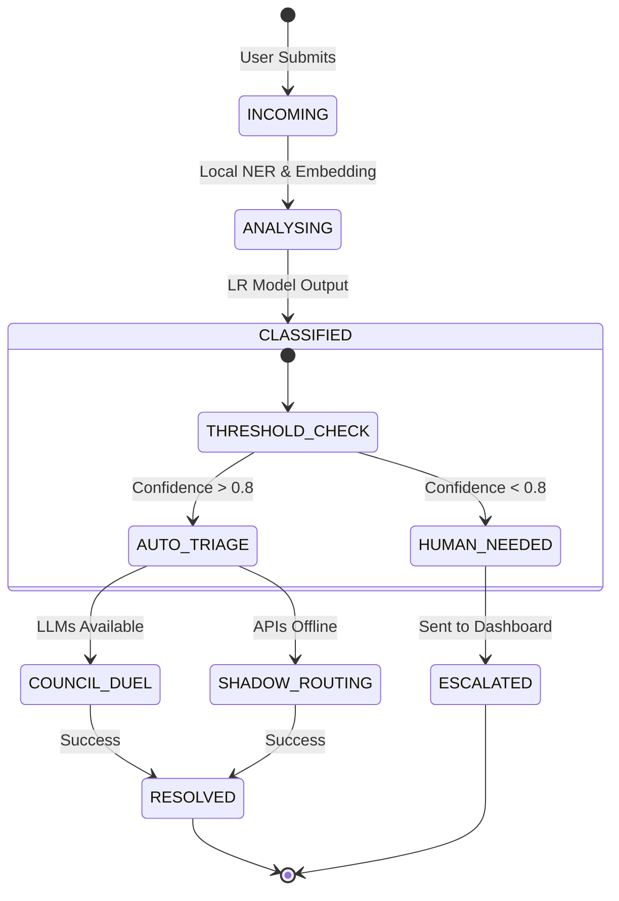

# Sugoi Bot: Zero-Trust Agentic IT Helpdesk
### Comprehensive Solution Architecture & Design Documentation
**Version 4.0 · Council Duel Synthesis · Honey & Cream UX**

---

## 1. Executive Summary
Sugoi Bot is a high-fidelity, multi-agent IT triage system designed to handle Level-1 support tickets autonomously. It features a "Zero-Trust" architecture where PII is redacted locally at the edge, and technical resolutions are cross-verified by a "Council" of LLMs (Gemini & Llama) before being presented to the user.

---

## 2. Proposed Solution Architecture
The architecture is divided into three primary layers: the **Ingress Edge**, the **Inference Council**, and the **Persistence Layer**.

### Component Diagram

---

## 3. Low-Level Design (LLD)

### A. Local ML Pipeline (Edge)
- **PII Redaction**: Uses `Xenova/bert-base-NER` running in-browser/serverless via Transformers.js.
- **Classification Engine**: A deterministic implementation of Logistic Regression. Weights and intercepts are stored in JSON, allowing classification to happen without external API calls, ensuring high speed and low cost.
- **Confidence Scaling**: Employs Temperature Scaling ($T=0.7$) on logits to produce realistic probability distributions.

### B. The Council Duel (Synthesis)
- **Concurrency**: Triggered via `Promise.all` for minimal latency.
- **Evaluation**: The "Winner" is determined by a scoring function that weights:
    1. **Technical Density**: Number of markdown code blocks and lists.
    2. **Length**: Completeness of the resolution.
    3. **Persona Adherence**: Correct formatting of the "Sugoi Analysis" section.

### C. Shadow Router (Deterministic Fallback)
- If all LLM APIs (Google/Groq) fail or rate-limit, the system falls back to a **Keyword Scoring Matrix**.
- **The Vault**: A collection of 20+ expert-verified markdown templates indexed by technical keywords (e.g., `OOM`, `Deadlock`, `B-Tree`).

---

## 4. Data Engineering Approach

### Pipeline Workflow
1. **Extraction**: Raw IT ticket data (9,000+ rows) sourced from Kaggle.
2. **Sanitization**: Automated removal of noise (email headers, signatures) and normalization of categories (Network, Database, Hardware).
3. **Embedding Generation**: Pre-computed 384-dimensional vectors using `all-MiniLM-L6-v2`.
4. **Vector Loading**: Bulk UPSERT into Supabase `historical_tickets` table using `pgvector`.

---

## 5. Data Model (Entity Relationship Diagram)

---

## 6. Data Flow Diagram (DFD)

---

## 7. Sequence Diagram: Ticket Triage Flow

---

## 8. State Transition Diagram: Ticket Lifecycle

---

## 9. List of Data Sources
1. **Primary Dataset**: Kaggle IT Support Ticket dataset (augmented with synthetic anomalies).
2. **Procedural Memory**: Custom-built `agentic_skills` table (Deterministic IT Runbooks).
3. **Keyword Vault**: Hardcoded technical pattern matrix for shadow routing.

---

## 10. Open-Source Tools & Libraries
- **Framework**: Next.js 15 (App Router), TypeScript.
- **ML Inference**: Transformers.js (Hugging Face), ONNX Runtime.
- **Vector Database**: Supabase + pgvector extension.
- **LLM APIs**: Google Gemini 1.5 Flash, Groq (Llama 3.3 70B).
- **Styling/Animations**: GSAP (GreenSock), Tailwind CSS, Framer Motion.
- **Utilities**: Upstash Redis (Rate limiting), Zod (Validation), Lucide React.

---
**Sugoi Bot v4.0** remains the most robust, secure, and visually stunning helpdesk solution for the modern enterprise.
