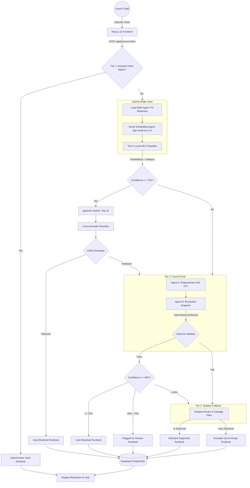
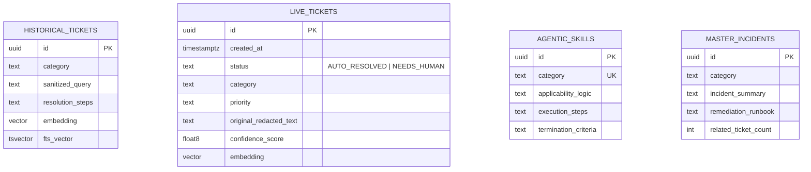
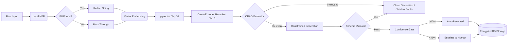
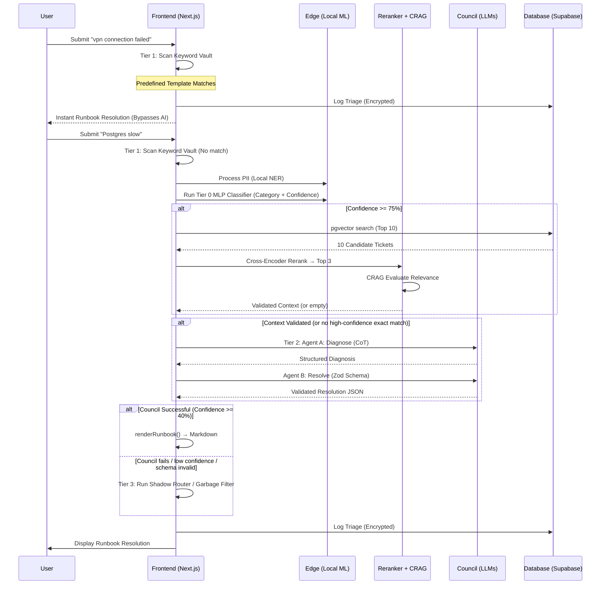
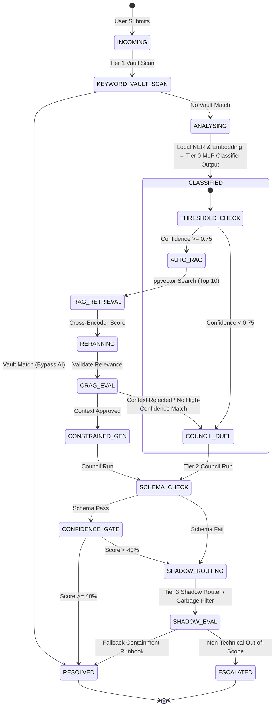

# Sugoi Bot: Zero-Trust Agentic IT Helpdesk
### Comprehensive Solution Architecture & Design Documentation
**Version 5.0 · Rigorous Synthesis · Anti-Hallucination Engine**

---

## 1. Executive Summary
Sugoi Bot is a high-fidelity, multi-agent IT triage system designed to handle Level-1 support tickets autonomously. It features a **"Zero-Trust"** architecture where PII is redacted locally at the edge, technical resolutions are **constrained by Zod schemas** and **cross-verified by Corrective RAG (CRAG)**, and responses are validated by a Cross-Encoder Reranker before being presented to the user. Version 5.0 introduces the **Anti-Hallucination Engine** — three guardrail layers ensuring mathematical and logical correctness in every resolution.

---

## 2. Proposed Solution Architecture
The architecture is divided into five primary layers: the **Ingress Edge**, the **RAG + Reranking Layer**, the **CRAG Validator**, the **Constrained Inference Council**, and the **Persistence Layer**.

### Component Diagram


---

## 3. Low-Level Design (LLD)

### A. Local ML Pipeline (Edge)
- **PII Redaction**: Uses `Xenova/bert-base-NER` running in-browser/serverless via Transformers.js.
- **Classification Engine**: Multi-Layer Perceptron (MLP) classifier with hidden layers `(100, 50)` trained on a balanced, shuffled dataset (english_tickets.csv + GitHub helpdesk tickets from Kaggle). Weights are exported to JSON for a pure matrix-multiplication forward pass in serverless environments.
- **Activation & Output**: Employs Rectified Linear Unit (ReLU) activations between hidden layers, and Softmax on the output layer to produce probability distributions over the 6 system categories.

### B. Anti-Hallucination Engine (v5.0)

#### Layer 1: Constrained Generation
- **Zod Schema Enforcement**: Every LLM resolution is constrained by a strict `ResolutionSchema` via `generateObject`. Required fields include `root_cause`, `confidence_score`, `prerequisites`, `steps` (each with `expected_output` and `is_destructive` flags), `rollback_plan`, and `verification`.
- **Chain-of-Thought (CoT)**: Agent A (Diagnostician) is forced to produce a `<thinking>` block analyzing root cause, affected systems, and destructive risks before diagnosis.
- **Deterministic Rendering**: Validated JSON is converted to markdown via a server-side template (`renderRunbook()`), eliminating LLM formatting drift.
- **Confidence Gating**: If the model's self-assessed confidence is below 40%, the ticket is auto-escalated to human review.

#### Layer 2: CRAG + Cross-Encoder Reranking
- **Cross-Encoder Reranker**: After pgvector returns 10 candidates, they are scored by `Xenova/ms-marco-MiniLM-L-6-v2` which reads each (query, document) pair simultaneously. Only the top 3 mathematically proven matches survive.
- **Corrective RAG (CRAG)**: A lightweight LLM evaluator validates whether the top 3 documents actually contain the solution. If not, the context is dropped entirely to prevent hallucination from irrelevant context.

#### Layer 3: DSPy Validation
- **Programmatic Prompt Optimization**: Uses the DSPy framework to automatically compile optimal system prompts by maximizing F1 score and technical correctness across the evaluation dataset.
- **Automated Evaluation**: LLM-as-Judge scoring, schema compliance rate, and CRAG rejection rate are tracked as metrics.

### C. The Council Duel (Synthesis)
- **Concurrency**: Triggered via `Promise.all` for minimal latency.
- **Evaluation**: The "Winner" is determined by a scoring function that weights:
    1. **Technical Density**: Number of markdown code blocks and lists.
    2. **Length**: Completeness of the resolution.
    3. **Persona Adherence**: Correct formatting of the "Sugoi Analysis" section.

### D. Multi-Tier Triage Routing
The triage pipeline uses a multi-tier structure to resolve issues, optimizing for deterministic solutions and falling back gracefully to LLMs or heuristics:
- **Tier 1 (Deterministic Keyword Vault)**: Prior to classification, the ticket text is scanned against the Keyword Vault. If exact phrases (e.g. `cannot login`, `vpn connection failed`) or high-confidence keyword thresholds are matched, a pre-verified runbook template is immediately returned.
- **Tier 0 (Local MLP Classifier)**: Runs a local 3-layer forward neural network to classify the ticket into one of the 6 core categories. High confidence (>=75%) triggers a CRAG search for exact historical matches.
- **Tier 2 (External LLM Council)**: A parallel run of Gemini and Groq with Zod schema validation to synthesize new resolutions.
- **Tier 3 (Shadow Router & Garbage Filter)**: The final line of defense. Filters non-technical inputs (escalates with 0% confidence as "Out-of-Scope") and routes weird technical inputs using a universal IT containment template.


---

## 4. Data Engineering Approach

### Pipeline Workflow
1. **Extraction**: Two data sources merged:
   - Kaggle IT Support Tickets (english_tickets.csv) — 7,000+ rows of traditional helpdesk data.
   - Kaggle GitHub Helpdesk Tickets (`tobiasbueck/helpdesk-github-tickets`) — high-quality GitHub issues selected by AI, with real Q&A pairs.
   - **Result**: A comprehensive corpus of 26,000+ diverse IT support tickets.
2. **Normalization**: ETL script maps GitHub labels to 6 system categories via keyword heuristics. Schema unified to (Subject, Body, Answer, Queue, Priority).
3. **Deduplication**: MD5 hash on Subject+Body to remove duplicates across datasets.
4. **Embedding Generation**: Pre-computed 384-dimensional vectors using `bge-small-en-v1.5`.
5. **Vector Loading**: Bulk UPSERT into Supabase `historical_tickets` table using `pgvector`.
6. **Edge ML Deployment**: The Multi-Layer Perceptron (MLP) weights are exported to `data/lr_model.json` and `public/models/classifier.onnx`, natively supported by **Vercel Serverless/Edge Functions** without external dependencies.

### Dataset Category Mapping
```
GitHub Labels → System Categories:
  security, vulnerability, cve, auth      → Security
  database, sql, migration, postgres      → Database
  network, dns, http, api, connection     → Network
  access, permission, role, login         → Access Management
  infra, deploy, docker, k8s, server      → Infrastructure
  bug, error, fix, feature, ui            → Application
```

---

## 5. Data Model (Entity Relationship Diagram)



---

## 6. Data Flow Diagram (DFD)



---

## 7. Sequence Diagram: Ticket Triage Flow



---

## 8. State Transition Diagram: Ticket Lifecycle



---

## 9. List of Data Sources
1. **Primary Dataset**: Kaggle IT Support Ticket dataset (english_tickets.csv — traditional helpdesk data).
2. **Secondary Dataset**: Kaggle GitHub Helpdesk Tickets (`tobiasbueck/helpdesk-github-tickets` — high-quality GitHub issues with real Q&A).
3. **Merged Dataset**: `merged_tickets.csv` — deduplicated union of both sources with normalized categories.
4. **Procedural Memory**: Custom-built `agentic_skills` table (Deterministic IT Runbooks).
5. **Keyword Vault**: Hardcoded technical pattern matrix for shadow routing.

---

## 10. Open-Source Tools & Libraries
- **Framework**: Next.js 15 (App Router), TypeScript.
- **ML Inference**: Transformers.js (Hugging Face), ONNX Runtime.
- **Vector Database**: Supabase + pgvector extension.
- **LLM APIs**: Google Gemini 1.5 Flash, Groq (Llama 3.3 70B).
- **Anti-Hallucination**: Zod (Schema Enforcement), Cross-Encoder Reranker (ms-marco-MiniLM), CRAG Evaluator, DSPy (Programmatic Prompt Optimization).
- **Styling/Animations**: GSAP (GreenSock), Tailwind CSS, Framer Motion.
- **Utilities**: Upstash Redis (Rate limiting), Lucide React, kagglehub (Dataset management).

---
**Sugoi Bot v5.0 "Rigorous Synthesis"** — the most robust, technically correct, and anti-hallucination IT helpdesk solution for the modern enterprise.
